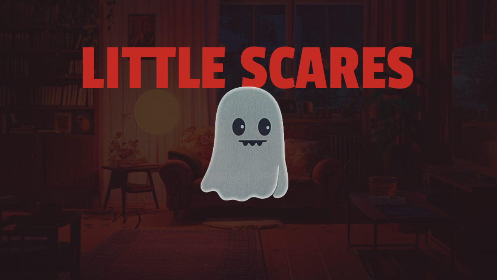

# Readme

[]

### Description

"Little Scares" is an engaging browser-based game where players control an invisible ghost with a mission to scare a character in an indoor setting. Players must strategically interact with various objects in the room to create scares, while the human character is trying to undo these actions. This all needs to be done in a certain time as the countdown gambles your win. The game's focus on strategy, timing, and careful maneuvering offers a captivating and unique gaming experience.

### Instructions to play

You can control the little ghost using the arrow keys. To interact with an object, use the spacebar.

### Demo

Here you can find a one level demo of the game:

[<kbd>   Play the Demo   </kbd>](https://gummiz.github.io/little-scares-game/)